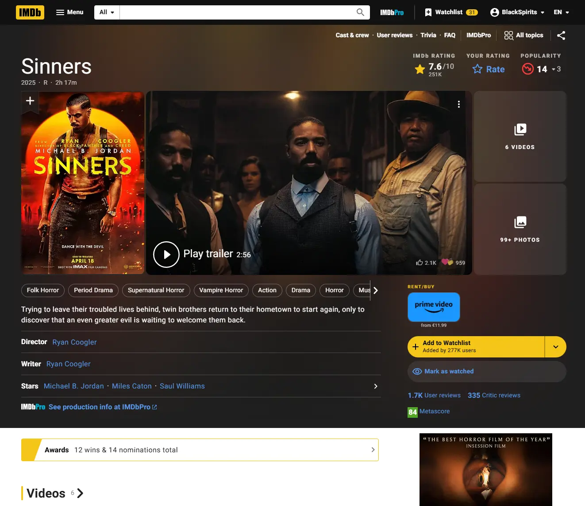
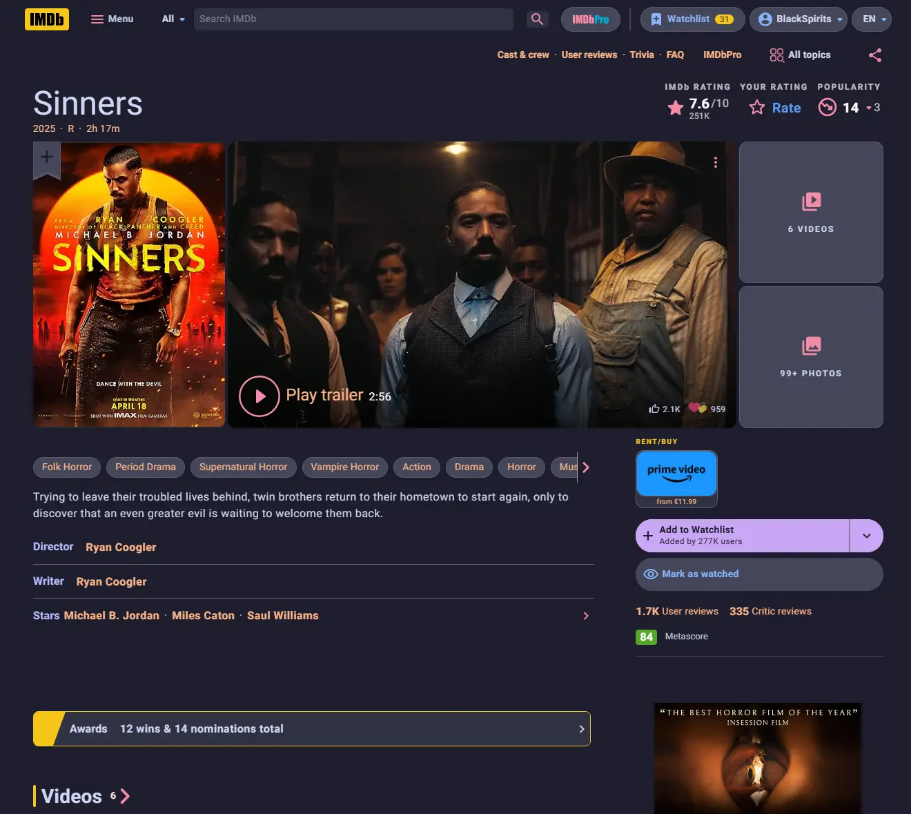

# 🖥️ BlackSpirits — UserScripts & UserStyles

<!-- Hero/banner -->

  <a href="https://github.com/BlackSpirits/UserScripts/stargazers" rel="noopener">
    <picture>
      <source srcset="./assets/readme-hero.webp" type="image/webp" />
      
    </picture>
  </a>

<!-- Repo status — Light w/ dark logos -->

  
  
  
  
  

<!-- Support — Light w/ dark logos -->

  
  

  

## 📂 Available Scripts & Styles

| Name | Type | Description | Install |
|------|------|-------------|---------|
| **IMDb — Catppuccin Mocha Theme** | UserStyle | Elegant dark theme for IMDb based on the Catppuccin Mocha palette. |  |
| **IMDb — Ad & IMDbPro Cleaner** | UserScript | Removes IMDb ads, IMDbPro upsell panels, and other clutter. |  |
| **Torrenting.com — Auto Posters** | UserScript | Displays posters in torrent listings with optimized layout on Torrenting.com. |  |

  

## 🔧 Installation

### For UserScripts (.user.js)
1. Install a user script manager:
   - [Tampermonkey](https://www.tampermonkey.net/)
   - [Violentmonkey](https://violentmonkey.github.io/)
2. Click the **Install** button in the table above.  
3. Confirm installation in your script manager.

### For UserStyles (.user.css)
1. Install [Stylus](https://add0n.com/stylus.html).  
2. Click the **Install** button in the table above.  
3. Activate the style in Stylus.

  

### 🧭 Browser support
| Browser | UserScripts | UserStyles |
|---------|-------------|-----------|
| Chrome  | ✔️ Works (Tampermonkey / Violentmonkey) | ✔️ Works (Stylus) |
| Firefox | ✔️ Works | ✔️ Works |
| Edge    | ✔️ Works | ✔️ Works |
| Safari  | 🧪 Not tested (help wanted) | 🧪 Not tested (help wanted) |

Legend: ✔️ works · ⚠️ partial · 🧪 not tested · ✖️ no support —  
Safari not tested: **[help us verify](https://github.com/BlackSpirits/UserScripts/issues/new?labels=browser%3Asafari&title=Safari%20support%20report&template=bug_report.md)**

> Not affiliated with IMDb or Amazon. All trademarks are property of their respective owners.

  

## 🖼️ Screenshots

  
IMDb — Catppuccin Mocha Theme (before/after)

| Before | After |
|---|---|
|  |  |

  

### 🗒️ Changelog
See **[Releases](https://github.com/BlackSpirits/UserScripts/releases)** for notable changes.

  

## 🛠️ Contributing & Feedback

- Found a **bug** or have a suggestion? Open an [issue](https://github.com/BlackSpirits/UserScripts/issues).  
- Want to improve a script or add a new one? Send a **pull request** with clear changes.

  

## ☕ Support the project

  <!-- If you add ./assets/kofi.gif to the repo, swap the src below to that path -->
  

  
  

  

## 📜 License

Released under the [MIT License](./LICENSE).  
© 2025 BlackSpirits.
<a href="#readme">↑ Back to top</a>

