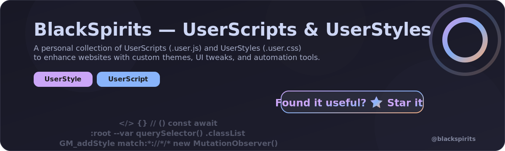

<!-- Hero/banner -->

  <a href="https://github.com/BlackSpirits/UserScripts/stargazers" rel="noopener">
    <picture>
      <source srcset="./assets/readme-hero.webp" type="image/webp" />
      
    </picture>
  </a>

<!-- Repo status -->

  
  
  
  
  

<!-- Support -->

  
  

  

## 📂 Available Scripts & Styles

| Name | Type | Description | Install |
|------|------|-------------|---------|
| **IMDb — Catppuccin Mocha Theme** | UserStyle | Elegant dark theme for IMDb based on the Catppuccin Mocha palette. |  |
| **IMDb — Ad & IMDbPro Cleaner** | UserScript | Removes IMDb ads, IMDbPro upsell panels, and other clutter. |  |
| **Torrenting.com — Auto Posters** | UserScript | Displays posters in torrent listings with optimized layout on Torrenting.com. |  |

  

## ✨ IMDb — Catppuccin Mocha Theme (v2.2)

**Features**
- Catppuccin Mocha palette across IMDb
- Transparent hero rating bar with unified hover/radius
- Styled header flyouts (User/Language), enhanced autosuggest
- Awards highlights and improved subnav spacing
- “Cast & crew”, “Company credits”, “All topics”, “More from” links unified (peach + lavender hover)
- Full Credits page refinements: actor (mauve), character (peach), producer label dimmed
- Filmography accordions: soft single divider, transparent headers
- Consistent icons and ribbons on dark backgrounds

**Requirements**  
Works on all IMDb pages.

**Support**  
Open issues or feature requests here:  
[GitHub Issues](https://github.com/BlackSpirits/UserScripts/issues)

**Changelog (highlights)**
- **v2.2**: Lavender section headers & labels for Release Dates/AKAs; link color unification; accordion and menu cleanups; icon/ribbon contrast.
- **v2.1**: Bio/Name details tuning (lavender titles, peach values), FAQ answers peach, Starmeter spacing.
- **v2.0**: Major refresh with Catppuccin Mocha palette and transparent rating bar.

  

## 🔧 Installation

### UserScripts (.user.js)
1. Install a manager: [Tampermonkey](https://www.tampermonkey.net/) or [Violentmonkey](https://violentmonkey.github.io/).
2. Click **Install** in the table above and confirm.

### UserStyles (.user.css)
1. Install [Stylus](https://add0n.com/stylus.html).
2. Click **Install** in the table above and enable the style.

  

### 🧭 Browser support
| Browser | UserScripts | UserStyles |
|---------|-------------|-----------|
| Chrome  | ✔️ Works (Tampermonkey / Violentmonkey) | ✔️ Works (Stylus) |
| Firefox | ✔️ Works | ✔️ Works |
| Edge    | ✔️ Works | ✔️ Works |
| Safari  | 🧪 Not tested (help wanted) | 🧪 Not tested (help wanted) |

Legend: ✔️ works · ⚠️ partial · 🧪 not tested · ✖️ no support  
Not affiliated with IMDb or Amazon. Trademarks belong to their owners.

  

## 🖼️ Screenshots

  
IMDb — Catppuccin Mocha Theme (before/after)

| Before | After |
|---|---|
|  |  |

  

## 🗒️ Releases
See **[Releases](https://github.com/BlackSpirits/UserScripts/releases)** for full change logs.

  

## 🛠️ Contributing & Feedback
- Found a bug or have a suggestion? Open an [issue](https://github.com/BlackSpirits/UserScripts/issues).
- Want to improve a script or add a new one? Send a pull request.

  

## ☕ Support the project

  

  
  

  

## 📜 License
Released under the [MIT License](./LICENSE).  
© 2025 BlackSpirits. 
<a href="#readme">↑ Back to top</a>

